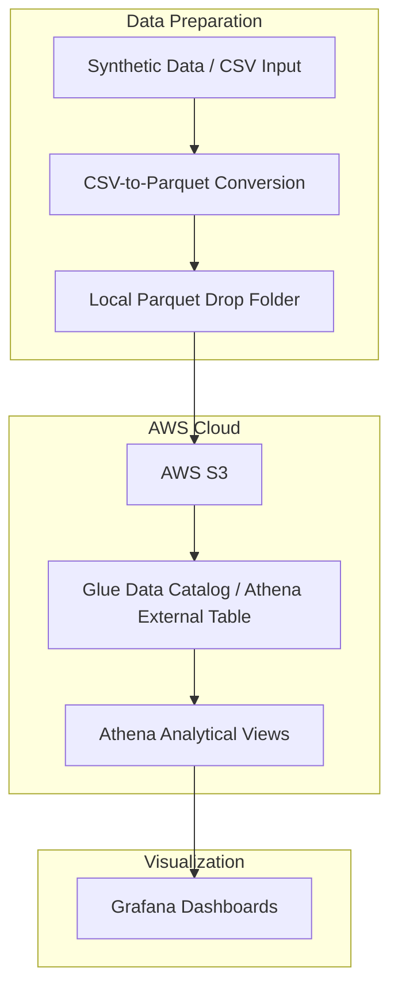
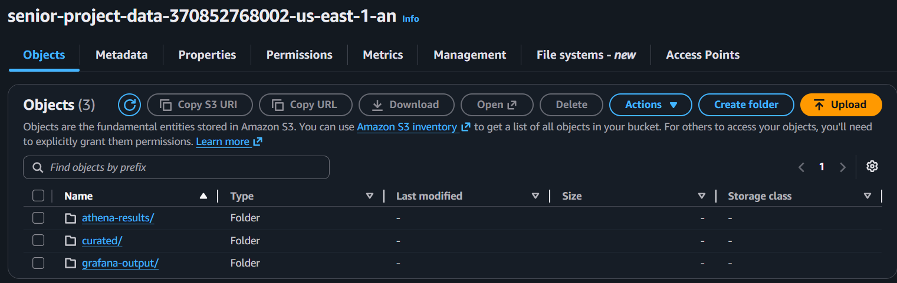
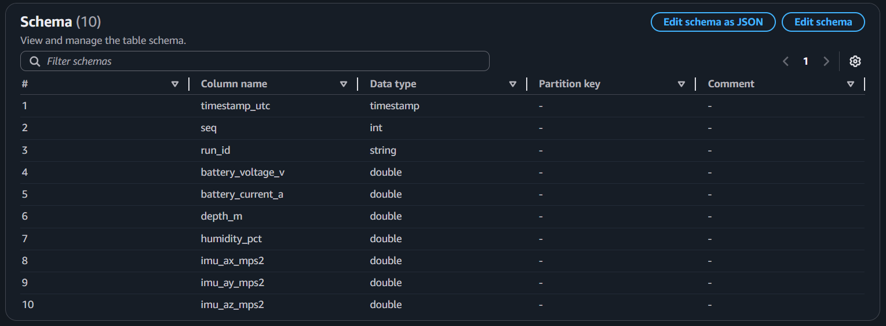
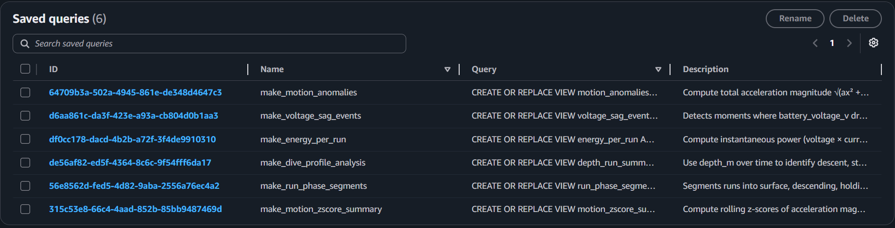
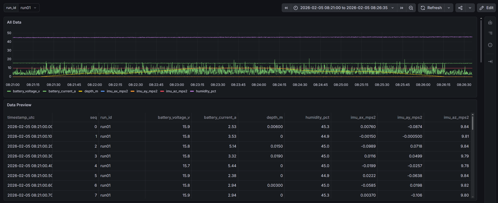

# Submarine Telemetry Analytics Pipeline

Submarine Telemetry Analytics Pipeline is a cloud-based telemetry analysis project for underwater vehicle run data. It was built to process synthetic submarine telemetry, store the data in AWS S3, define reusable Athena SQL views, and visualize run-level analysis in Grafana.

## Project Background

This project was developed as part of a Cal Poly senior project in support of Naval Innovations, an Instructionally Related Activity focused on building an autonomous submarine.

The project focused on creating a centralized pipeline for submarine telemetry analysis. As the vehicle produces more test data, manually organizing telemetry files and generating visualizations becomes harder to manage. This system was built to move telemetry into AWS, query it through Athena, and display analysis results in Grafana.

## Project Status

This repository is an archived portfolio version of a completed senior project. It preserves the project structure, SQL definitions, scripts, documentation, and screenshots from the original development environment, but is not connected to the original live deployment.

The current pipeline is:

```text
Synthetic telemetry / CSV input -> Parquet -> S3 -> Glue Data Catalog / Athena -> Grafana
```

## Documentation

Additional project documentation can be found in:

* [`docs/schema.md`](docs/schema.md)
* [`sql/`](sql/)

The schema documentation describes the telemetry data structure, while the SQL files define the Athena table and analytical views used by the pipeline.

---

## How to Use

Telemetry data enters the pipeline through the local data folders. The project currently supports two input paths:

1. Add an existing Parquet telemetry file to [`data/parquet_out/`](data/parquet_out/). If starting from CSV data, use the provided CSV-to-Parquet converter before placing the output in this folder.
2. Generate synthetic telemetry using the provided generator. Generated runs are written to [`data/parquet_out/`](data/parquet_out/) automatically.

In the original project environment, updates to the Parquet data triggered the AWS processing pipeline, allowing the Athena views and Grafana dashboards to reflect the latest telemetry. 

---

## System Architecture

This project was built around moving submarine telemetry into AWS so it can be queried with Athena and visualized in Grafana.

The pipeline uses Parquet as its telemetry storage format. Parquet files can either be provided directly or generated with the included synthetic telemetry generator. All Parquet outputs are collected in:

[`data/parquet_out/`](data/parquet_out/)

In the original project environment, updates pushed to GitHub triggered the AWS processing pipeline, which uploaded telemetry data to the project S3 bucket. Athena read the uploaded Parquet files through the `sensor_data` external table, and Grafana queried Athena views built on top of that table.

High-level flow:



---

## Repository Structure

- [`archive/`](archive/) – Archived and deprecated files from earlier versions of the project.
- [`config/`](config/) – Configuration files used throughout the pipeline.
- [`data/`](data/) – Telemetry datasets and generated Parquet outputs.
- [`docs/`](docs/) – User guides, schema documentation, and project documentation.
- [`scripts/`](scripts/) – Utility scripts including telemetry generation and data conversion.
- [`sql/`](sql/) – Athena table and view definitions.
- [`src/`](src/) – Main project source code.
- [`README.md`](README.md) – Project overview and setup instructions.
- [`pyproject.toml`](pyproject.toml) – Python project configuration and dependencies.
---

## Data Model / Schema

The main Athena table is:

```text
sensor_data
```

Each row represents one telemetry sample from a run.

Key identifier columns:

* `timestamp_utc`
* `seq`
* `run_id`

Main sensor columns include:

* `battery_voltage_v`
* `battery_current_a`
* `depth_m`
* `humidity_pct`
* `imu_ax_mps2`
* `imu_ay_mps2`
* `imu_az_mps2`

For the full schema, see [`docs/schema.md`](docs/schema.md).

---

## AWS Setup

The project uses AWS S3 to store Parquet telemetry data and Amazon Athena to query it.

Telemetry Parquet files are stored in S3 under:

```text
s3://senior-project-data-370852768002-us-east-1-an/curated/
```


Athena reads the Parquet data through an external table named `sensor_data`. The table metadata is stored in the Glue Data Catalog, allowing Athena to treat the files in S3 as a queryable table.



Main Athena database:

```text
senior_project
```

Main Athena table:

```text
sensor_data
```

Athena views are defined on top of `sensor_data` and are used as the query layer for Grafana panels.



Athena query results are written to:

```text
s3://senior-project-data-370852768002-us-east-1-an/athena-results/
```

---

## Athena SQL Views

The project stores Athena SQL definitions in the repository so the views can be recreated if needed. This prevents the query logic from existing only inside the AWS console.

The SQL files are located in [`sql/`](sql/).

The main Athena views include:

### Energy Consumption Per Run

Estimates total battery energy usage for each run in watt-hours using current and voltage telemetry. The output is grouped by `run_id`.

### Dive / Depth Summary

Uses `depth_m` over time to summarize depth behavior for each run, including maximum depth, average depth, vertical movement rate, and time spent near maximum depth.

### Voltage Sag Events

Finds points where voltage drops while current increases. This is used to identify possible high-load moments in the battery data.

### Phase Segmentation

Labels telemetry rows as `surface`, `descending`, `holding_depth`, or `ascending` based on depth and vertical movement rate. This supports phase-based Grafana panels such as time spent per phase and average current/voltage per phase.

### IMU Motion Anomaly Detection

Uses acceleration data from the IMU to estimate motion intensity and flag unusually large deviations from recent motion behavior.

### IMU Motion Z-Score Summary

Summarizes rolling acceleration z-score behavior for each run, including maximum deviation, average deviation, and high-percentile deviation values. This helps characterize overall motion variability even when no individual samples cross the anomaly threshold.

---

## Grafana Dashboards

Grafana serves as the primary visualization layer for the project. Dashboard panels query Athena views built on top of telemetry data stored in AWS S3, allowing users to analyze submarine telemetry without directly interacting with the underlying datasets.

The dashboards are intended to help users:

* Monitor sensor outputs
* Review telemetry from individual runs
* Analyze expected vehicle performance
* Identify trends and anomalies in collected data
* Compare telemetry metrics across runs

### Dashboard Overview



The dashboard provides access to telemetry generated during a run. Users can inspect battery measurements, depth, humidity, and IMU sensor outputs through both graphical and tabular views. The dashboard is filtered by run ID, with every panel updating.

Current dashboard visualizations include telemetry plots for:

* Battery voltage
* Battery current
* Depth
* Humidity
* IMU acceleration data
* Run-specific telemetry tables

### Interactive Dashboard Snapshot

A public snapshot of the dashboard is available at:

[View Interactive Dashboard Snapshot](https://denniskulik1.grafana.net/dashboard/snapshot/pqY7Z9ybOrPcKcgtzdINdYoD2qPmqH70)

The snapshot provides an example of the dashboard and can be viewed without requiring access to the AWS environment.

### Future Improvements

The dashboards currently use synthetic telemetry data generated from expected submarine operating conditions. If real telemetry becomes available, the synthetic data model and Athena views could be updated to better reflect actual vehicle behavior.

---

## Recreating the Pipeline

This repository preserves the code, SQL definitions, and documentation used by the original project environment. The original AWS/Grafana deployment is not maintained in this portfolio version, but the pipeline can be recreated with a new AWS and Grafana setup.

Start by adding Parquet telemetry data to [`data/parquet_out/`](data/parquet_out/). These files can be provided directly or generated with the included synthetic telemetry generator.

Upload the Parquet files to an S3 bucket/prefix configured for the recreated pipeline.

Create the main Athena external table by running [`sql/make_sensor_data.sql`](sql/make_sensor_data.sql). This creates the `sensor_data` table over the Parquet telemetry files stored in S3.

After `sensor_data` exists, run the remaining SQL files in [`sql/`](sql/) to create or recreate the Athena views.

Connect Grafana to Athena as a data source, then create or import dashboards that query the Athena views.

---

## Notes

* The current telemetry data is synthetic and does not represent real vehicle telemetry.
* The original AWS/Grafana deployment is not maintained in this portfolio version.
* Athena views are stored SQL definitions and recompute when queried.
* Grafana is used for visualization; analysis logic lives in Athena SQL views.
* Deprecated DuckDB files and older scripts are retained in `archive/` for reference but are not part of the current pipeline.

## References

The synthetic telemetry generator was informed by published underwater robotics dataset work, especially the VAROS synthetic underwater dataset. VAROS was used as a reference for modeling realistic sensor ranges and underwater run behavior, but no VAROS data is included in this repository.

Peder Georg Olofsson Zwilgmeyer, Mauhing Yip, Andreas Langeland Teigen, Rudolf Mester, and Annette Stahl. “The VAROS Synthetic Underwater Data Set: Towards Realistic Multi-Sensor Underwater Data With Ground Truth.” Proceedings of the IEEE/CVF International Conference on Computer Vision (ICCV) Workshops, 2021, pp. 3722–3730.
