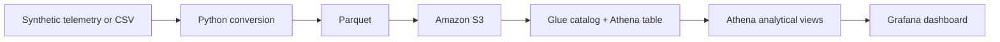
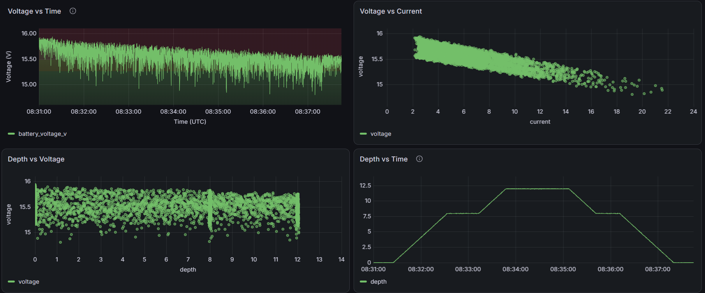
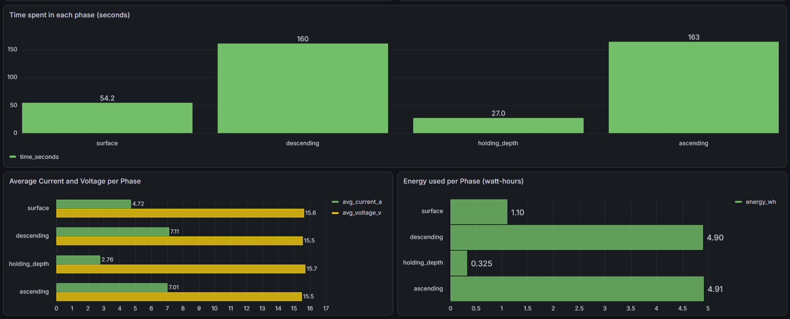

# Submarine Telemetry Analytics Pipeline

An end-to-end analytics pipeline that turns underwater vehicle telemetry into queryable, run-level insights using Python, Parquet, AWS, SQL, and Grafana.

Built as a Cal Poly senior project in support of Naval Innovations, an Instructionally Related Activity developing an autonomous submarine. This portfolio repository preserves the data model, synthetic-data tooling, Athena analytics, and dashboard evidence from the completed project.

> **Portfolio status:** The original AWS and Grafana deployment is no longer maintained. The included data is synthetic and does not represent real vehicle telemetry.

[View the Grafana dashboard snapshot](https://denniskulik1.grafana.net/dashboard/snapshot/pqY7Z9ybOrPcKcgtzdINdYoD2qPmqH70)


## What this project demonstrates

- Designed a cloud analytics path from CSV/Parquet files through Amazon S3, AWS Glue, Athena, and Grafana.
- Modeled time-series telemetry for battery, depth, humidity, and three-axis IMU measurements.
- Built a reproducible synthetic-data generator with configurable dive profiles and seeded noise.
- Used Athena window functions and common table expressions to calculate energy use, dive phases, voltage-sag events, and motion anomalies.
- Kept analytical logic in version-controlled SQL instead of only in cloud consoles or dashboard panels.
- Used columnar Parquet storage and a serverless query layer to avoid operating a dedicated database.

## Technology

| Layer | Tools | Purpose |
| --- | --- | --- |
| Data generation and conversion | Python, NumPy, pandas, PyArrow | Generate test runs and convert CSV telemetry to Parquet |
| Storage | Parquet, Amazon S3 | Store analysis-ready telemetry efficiently |
| Catalog and query | AWS Glue Data Catalog, Amazon Athena, SQL | Expose a common schema and compute reusable views |
| Visualization | Grafana | Filter and inspect telemetry by run |

## Architecture



Parquet files form the contract between local data preparation and the cloud analytics layer. Athena exposes them through the `sensor_data` external table; the SQL views then provide stable, dashboard-ready outputs. This separation keeps ingestion, analysis, and presentation independently replaceable.

## Run the local data tools

### Prerequisites

- Python 3.9 or newer
- `numpy`, `pandas`, and `pyarrow`

Clone the repository and install the local tooling dependencies:

```bash
git clone https://github.com/DennisKulik/Senior-Project.git
cd Senior-Project
python -m venv .venv
```

Activate the environment on macOS or Linux:

```bash
source .venv/bin/activate
```

Or on Windows PowerShell:

```powershell
.venv\Scripts\Activate.ps1
```

Then install the dependencies:

```bash
python -m pip install numpy pandas pyarrow
```

### Generate synthetic telemetry

```bash
python scripts/generate_synth_data.py
```

The generator creates six deterministic runs in `scripts/parquet_out/synth_runs/`. Each run follows a different depth profile and contains correlated depth, current, voltage, humidity, and IMU measurements. Change `RUNS` or `DEFAULT_CONFIG` in the script to model other scenarios.

The repository also includes the six portfolio sample runs in [`data/parquet_out/`](data/parquet_out/).

### Convert a CSV file to Parquet

Run the converter as a module from the repository root:

```bash
python -m scripts.csv_to_parquet path/to/input.csv --out data/parquet_out/my_run.parquet
```

The converter preserves the input column order, parses timestamp-like identifier fields, and can drop rows where every sensor value is missing:

```bash
python -m scripts.csv_to_parquet path/to/input.csv \
  --out data/parquet_out/my_run.parquet \
  --drop-all-nan-rows
```

## Recreate the AWS analytics layer

The cloud deployment is not included as infrastructure-as-code, so these steps require your own AWS and Grafana configuration:

1. Upload the generated or included Parquet files to an S3 prefix.
2. Update the `LOCATION` in [`sql/make_sensor_data.sql`](sql/make_sensor_data.sql) to that prefix.
3. Run `make_sensor_data.sql` in Athena to create the `sensor_data` external table.
4. Run the remaining files in [`sql/`](sql/) to create the analytical views.
5. Configure Grafana's Athena data source and build panels against those views.

The original deployment used S3 for both curated telemetry and Athena query results, with table metadata stored in the Glue Data Catalog.

## Analytics implemented

| SQL view | Technique | Result |
| --- | --- | --- |
| [`energy_per_run`](sql/energy_per_run.sql) | Time-delta integration of voltage x current | Estimated watt-hours consumed per run |
| [`depth_run_summary`](sql/dive_profile_analysis.sql) | Lagged samples and vertical-rate calculation | Maximum/average depth, ascent/descent rate, and time near maximum depth |
| [`voltage_sag_events`](sql/voltage_sag_events.sql) | Rolling voltage and current baselines | High-load events with simultaneous voltage drop and current spike |
| [`run_phase_segments`](sql/run_phase_segments.sql) | Rate thresholds and row-level classification | Surface, descending, holding-depth, and ascending labels |
| [`motion_anomalies`](sql/imu_motion_anomaly.sql) | Rolling acceleration magnitude z-score | IMU samples that deviate sharply from recent motion |
| [`motion_zscore_summary`](sql/motion_zscore_summary.sql) | Per-run percentile aggregation | Overall motion variability, including p95 and p99 deviation |

The table schema is documented in [`docs/schema.md`](docs/schema.md), and shorter descriptions of the analytical outputs are in [`docs/query_descriptions.md`](docs/query_descriptions.md).

### Dive and battery analysis

The dashboard relates voltage to time, current, and depth while displaying the selected run's dive profile. These views make load-related voltage behavior easier to distinguish from normal time-based battery drain.



### Phase-level analysis

Athena's row-level phase classifications support higher-level comparisons of time, current, voltage, and energy across surface, descending, holding-depth, and ascending behavior.



## Data model

Each row in `sensor_data` represents one sample from one vehicle run:

| Field group | Columns |
| --- | --- |
| Identity | `timestamp_utc`, `seq`, `run_id` |
| Electrical | `battery_voltage_v`, `battery_current_a` |
| Environment | `depth_m`, `humidity_pct` |
| Motion | `imu_ax_mps2`, `imu_ay_mps2`, `imu_az_mps2` |

`run_id` partitions the analytical window functions so calculations do not cross logging sessions. `timestamp_utc` and `seq` provide deterministic ordering within a run.

## Repository layout

```text
data/parquet_out/       Six sample telemetry runs
docs/                   Schema notes, query notes, and deployment screenshots
scripts/                Synthetic-data generator and CSV-to-Parquet converter
sql/                    Athena external-table and view definitions
src/utils/              Shared local path definitions
archive/                Deprecated experiments retained for project history
```

## Design decisions and limitations

- **Synthetic data:** The generator enabled development before real submarine telemetry was available. Its signal relationships approximate expected behavior; they are not a physics simulation or validation dataset.
- **Parquet over CSV in the analytics layer:** Columnar storage reduces unnecessary reads and preserves useful data types for Athena.
- **Views over materialized outputs:** The analysis stays simple to reproduce and always reflects the underlying telemetry, at the cost of recomputing when queried.
- **Threshold-based event detection:** Voltage-sag, phase, and anomaly thresholds are transparent and easy to tune, but would need validation against real vehicle data.
- **Archived deployment:** Cloud resources, Grafana provisioning, CI/CD configuration, and infrastructure-as-code are not included, so the repository documents rather than automatically recreates the full hosted system.

## Evidence from the original deployment

| S3 telemetry prefix | Glue/Athena schema | Athena queries |
| --- | --- | --- |
|  |  |  |

## Background and reference

The generator was informed by published underwater robotics dataset work, particularly the VAROS synthetic underwater dataset. VAROS helped guide realistic sensor ranges and run behavior; no VAROS data is included here.

P. G. O. Zwilgmeyer, M. Yip, A. L. Teigen, R. Mester, and A. Stahl, "The VAROS Synthetic Underwater Data Set: Towards Realistic Multi-Sensor Underwater Data With Ground Truth," *ICCV Workshops*, 2021, pp. 3722-3730.
